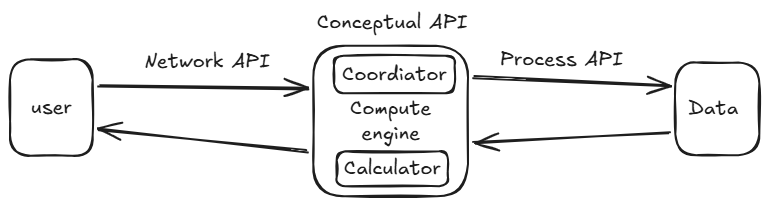

# Software Engineering Project

## Computation - Prime Factorization

The computation engine accepts a single positive integer as input and computes all of its prime factors in ascending order.

- Input: A single positive integer (84)
- Output: The list of prime factors whose product equals the input number (2, 2, 3, 7)

This requires looping through trial divisors to break down the number, which becomes CPU-intensive as the input numbers get large.

## System Diagram

